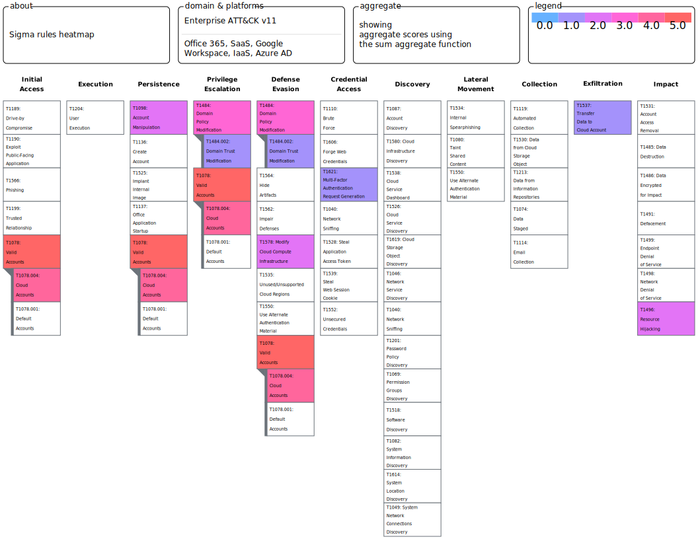

# Analytics

## List of Analytics

| Analytic                                                     | Description                                                  | ATT&CK TTP                                                   |
| ------------------------------------------------------------ | ------------------------------------------------------------ | ------------------------------------------------------------ |
| Autoscaling Threshold Exceeded (Azure)                       | Sigma correlation rule that identifies when the number of instances in the resource group is greater than the threshold | Resource Hijacking (T1496)                                   |
| Guest User Privilege Escalation (Azure)                      | Identifies when a guest user has privileges escalated to Global Administrator. | Valid Accounts (T1078)                                       |
| Guest User Privilege Escalation then Storage Blob Access Modified (Azure) | Sigma correlation rule that identifies the sequence of events when privileges of a guest user are escalated, and the same guest user makes a storage container for public access. | Valid Accounts (T1078), Modify Cloud Compute Infrastructure (T1578) |
| Role Elevated Outside of PIM (Azure)                         | Identifies when a privileged role assignment has been made outside of the Privileged Identity Management tool. | Domain Policy Modification (T1484)                           |
| Service Principal Privilege Escalation (Azure)               | Identifies when a service principal has privileges escalated to Global Administrator. | Valid Accounts (T1078)                                       |
| Storage Blob Access Modified (Azure)                         | Identifies when a previously existing storage container has access control modified to enable public access. | Modify Cloud Compute Infrastructure (T1578)                  |
| Multi-Factor Authentication Failure Threshold Exceeded (Azure) | Identifies when a user has failed multifactor authentication within a time window more than a pre-defined threshold. | Credential Access: Multi-Factor Authentication Request Generation (T1621) |
| Autoscaling Threshold Exceeded (GCP)                         | Sigma correlation rule that identifies when autoscaling events have exceeded a pre-threshold. | Resource Hijacking (T1496)                                   |
| Permissions Granted Over Service Account (GCP)               | Identifies when permissions granted to principal to impersonate or create keys for a service account. | Domain Policy Modification: Domain Trust Modification (T1484.002) |
| SSH Key Added (GCP)                                          | Identifies when an SSH key is added to an instance.          | Account Manipulation: Additional Cloud Credentials (T1098.001) |
| Google Storage Bucket Access Modified (GCP)                  | Identifies when a previously existing storage container has access control modified to enable public access. | Modify Cloud Compute Infrastructure (T1578)                  |
| Google VPC Service Controls Violation for Storage Bucket Access (GCP) | Identifies when a Storage Bucket access attempt has been blocked by VPC Service Controls. | Valid Accounts: Cloud Accounts (T1078.004), Exfiltration: Transfer Data to Cloud Account (T1537) |
| Workspace Login Marked Suspicious (GCP)                      | Identifies when a workspace login is marked suspicious.      | Valid Accounts: Cloud Accounts (T1078.004)                   |
| Workspace User Added to Privileged Group (GCP)               | Identifies when a user is added to a privileged group.       | Valid Accounts: Cloud Accounts (T1078.004), Account Manipulation: Additional Cloud Roles (T1098.003) |

## ATT&CK Mapping

ATT&CK Navigator heatmap of sigma rules.

