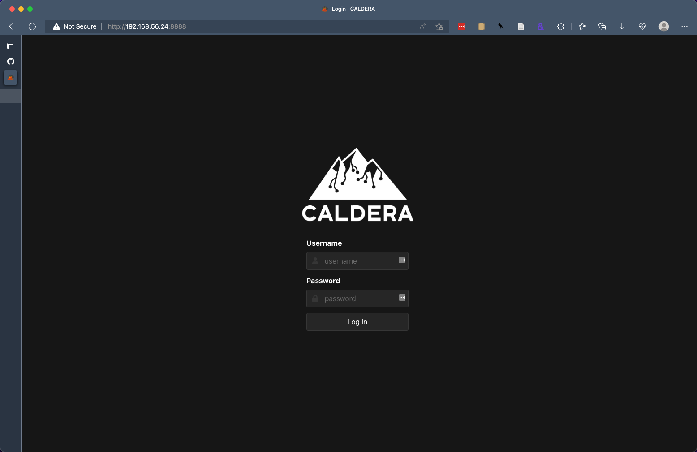
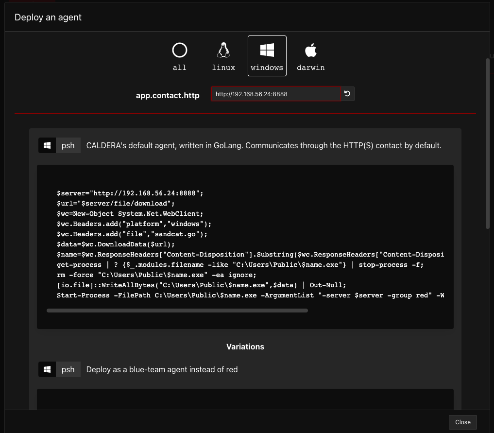
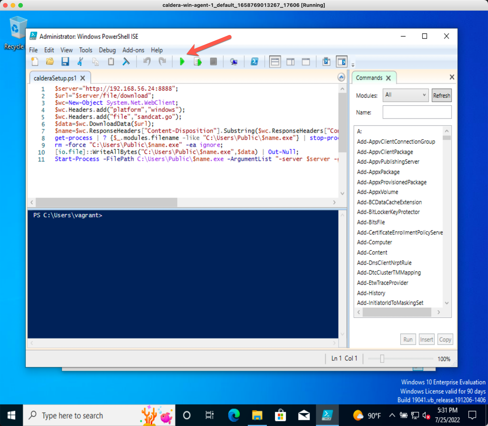
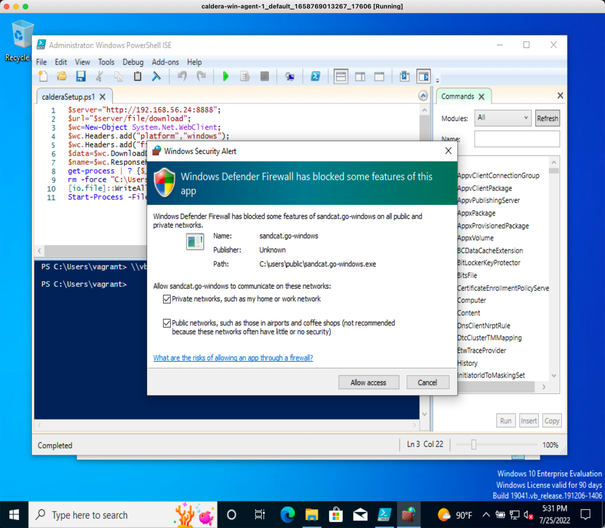
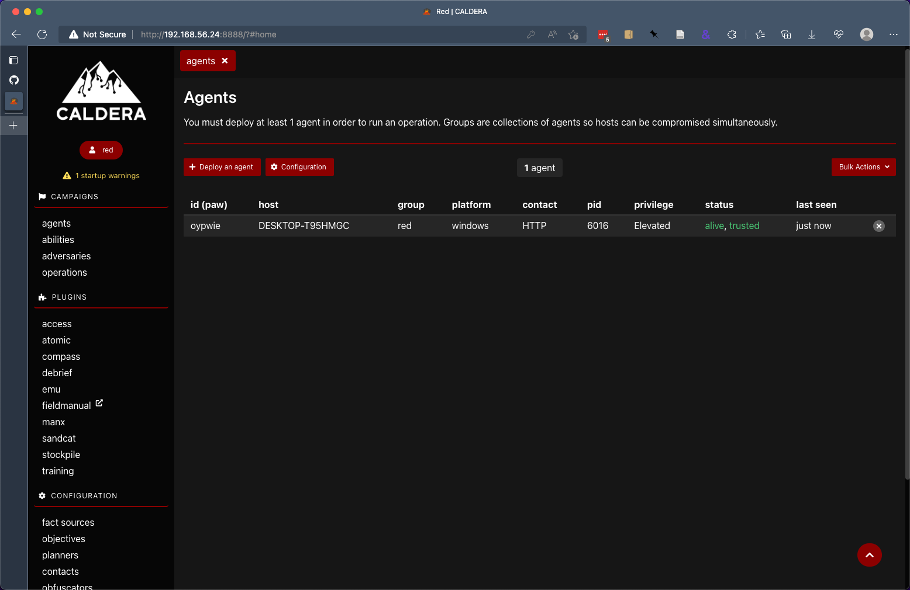
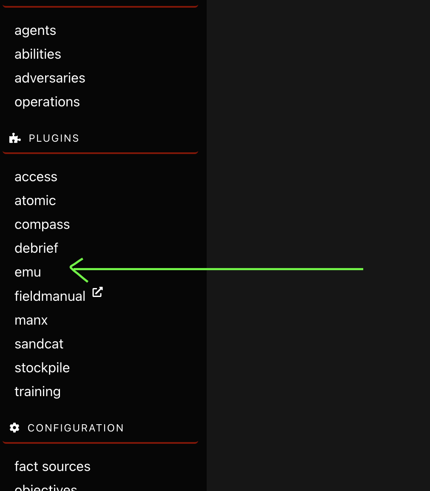
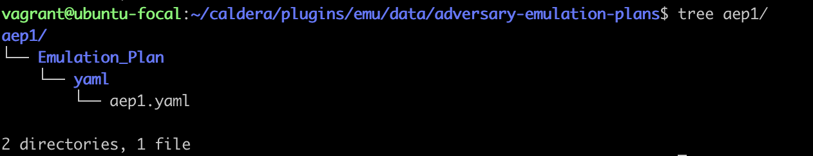
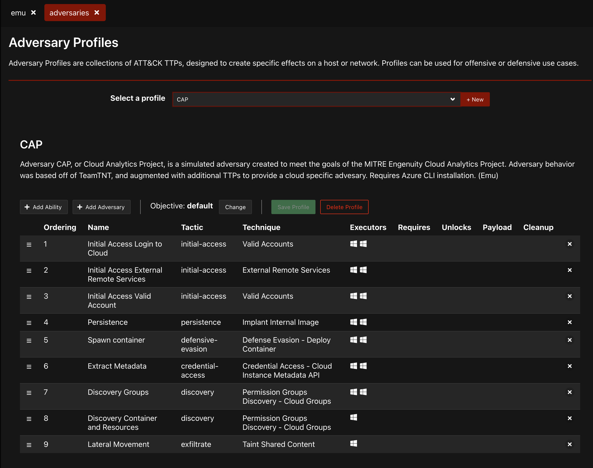
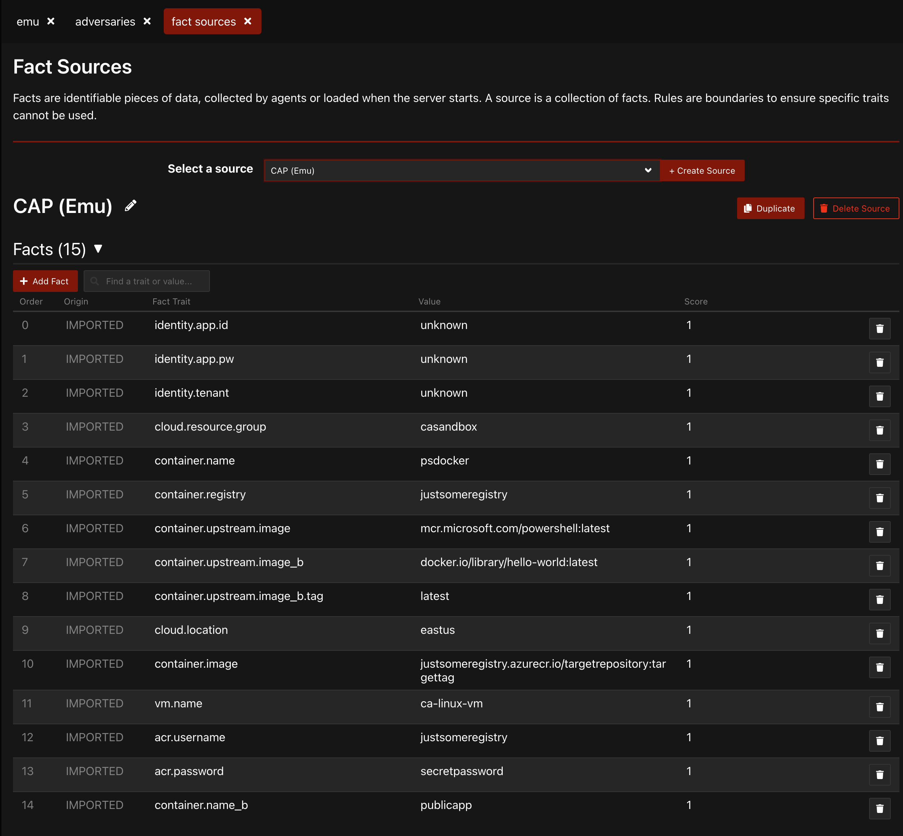

# Using Cloud Analytics with Caldera

Using the emu plugin for Caldera makes it easy, but it is not obvious how it works. The high level process is as follows:

__NOTE__: Caldera 4.0.0-beta was used for the following instructions. Not tested on other versions.

- [Using Cloud Analytics with Caldera](#using-cloud-analytics-with-caldera)
  - [Initial Setup](#initial-setup)
    - [Setup Caldera Server](#setup-caldera-server)
    - [Setup Windows Guest](#setup-windows-guest)
    - [Add Windows VM as Caldera Agent](#add-windows-vm-as-caldera-agent)
  - [Post-Install Setup](#post-install-setup)
    - [Ensure EMU Plugin is Enabled](#ensure-emu-plugin-is-enabled)
    - [Install New Advesary Emulation Plan](#install-new-advesary-emulation-plan)
        - [Option A: Install From AEP Archive](#option-a-install-from-aep-archive)
        - [Option B: Create Directory Layout Manually](#option-b-create-directory-layout-manually)
    - [Activate New Adversary Emulation Plan](#activate-new-adversary-emulation-plan)
  - [Validate](#validate)
    - [Adversary Profile](#adversary-profile)
    - [Fact Sources](#fact-sources)
  - [References](#references)

## Initial Setup

### Setup Caldera Server

NOTE: Assumes user has setup [Vagrant](https://www.vagrantup.com/) and [Virtualbox](https://www.virtualbox.org/). Vagrant provides a straightforward workflow to create a reusable, repeatable environment shareable by vagrant users.

Within the `cloud-analytics/emulation/caldera-vagrant/` directory, of the [Cloud Analytics](https://github.com/center-for-threat-informed-defense/cloud-analytics) project, there is a vagrant configuration which will install [Caldera](https://github.com/mitre/caldera) from scratch on a new virtual machine instance.

1. Open a terminal window, and change to the `caldera-vagrant` directory: `cd ./cloud-analytics/emulation/caldera-vagrant/`

2. Run `vagrant up` to initialize the vagrant environment. How long this takes is highly dependent on your network connection. Vagrant will first perform a one-time download of the base box, `ubuntu/focal64`, and then provision the VM by installing and configuring Caldera.

3. Once Caldera is fully provisioned, you should see a banner similar to the following, with a URL to connect to the Caldera web interface.

   1. __NOTE__: Due to a quirk in the Caldera 4.x beta, after vagrant is complete and the system boots up, you should wait approximately 3 minutes, then run `vagrant reload` from your host system to restart. Otherwise, Caldera may hang on plugin initialization and not fully startup the web interface. After waiting a few minutes and running `vagrant reload`, Caldera should properly start on all startups going forward. If you encounter a `ERR_CONNECTION_REFUSED` in your browser, you have encountered this issue. Just run `vagrant reload` and the problem should be permanently fixed going forward.

           ```
           ###########################################################
           #                                                         #
           #                                                         #
           #                                                         #
           #                                                         #
           #   Connect to Caldera at http://192.168.56.24:8888
           #                                                         #
           #                                                         #
           #                                                         #
           #                                                         #
           ###########################################################
           ```

4. Open a web browser and connect to Caldera at the URL specified in the terminal, as shown in the previous step. You should see a login screen similar to the following.

   1. 

5. Login with the default credentials

   1. ```
      username: red
      password: admin
      ```

### Setup Windows Guest

The Caldera server application will act as the emulation controller, however we need _Caldera Agents_ to perform the actual executions. In this example, we will deploy a Windows VM using Vagrant. The Windows instance will use a temporary evaluation license by default. Make sure this meets your organizational licensing requirements or install an appropriate license as needed.

1. Open a separate terminal, and navigate to the `cloud-analytics/emulation/caldera-win-agent-1` directory.
2. Run `vagrant up`
3. After the Windows system is fully booted, continue with the next section to add the Windows system as a Caldera agent.

### Add Windows VM as Caldera Agent

1. Within Caldera, navigate to the `Campaigns -> agents` section.
2. Click the `Deploy an Agent` button.
3. Select `Sandcat` from the dropdown menu.
4. Select `windows` under `Platform`.
5. Edit the `app.contact.http` setting from `http://0.0.0.0:8888` to the URL printed out earlier on the terminal when Caldera started up. In the earlier example, the URL is `http://192.168.56.24:8888`.
   1.
6. Copy the PowerShell code from the first section, with the title of `CALDERA's default agent, written in GoLang.`
7. Create a new file in the `caldera-win-agent-1` directory, titled `calderaSetup.ps1`. That directory should now have two files, `Vagrantfile` and `calderaSetup.ps1`.
8. Open a GUI console session to the Windows VM.
   1. Open the Virtualbox application.
   2. Look in the list of VMs for a name that begins with `caldera-win-agent-1-` . Vagrant appends additional characters to the name, but you only have to match the initial section.
   3. Select the VM on the left with a single click.
   4. Click the green `Show` button in the toolbar in the top right.
      1. 
   5. You should be logged in to a Windows VM. Use the Virtualbox -> View menu if you need to modify the display settings.
   6. If needed, the default Windows username and password are `vagrant` and `vagrant`, respectively.
9. From within the Windows guest, from the Start Menu, open the `Windows Powershell ISE` application __as an Administrator__.
10. Select `File -> Open` from the menu, and navigate to `C:\vagrant\`.
11. Open the file `calderaSetup.ps1`.
12. Click the `Play` icon to run the script.
    1. 
13. Windows Firewall will generate a notification due to the network access. For the Windows Firewall prompt, check both boxes and click `Allow Access`.
    1. 
14. Navigate back to the `Caldera` agents webpage on your host computer, and the new Windows agent should show in the `Agents` list.
    1. 

## Post-Install Setup

### Ensure EMU Plugin is Enabled

Make sure the emu plugin is enabled within Caldera. If not, navigate to _Configuration_ -> _configuration_-> _Plugins_, and enable the emu plugin, and restart Caldera. When enabled, you should see `emu` on the left side menu.



### Install New Advesary Emulation Plan

__NOTE__: If you are using the Vagrant Caldera setup installed earlier, read the following:

- You can ssh to the Caldera instance by `cd cloud-analytics/emulation/caldera-vagrant`, then running `vagrant ssh`.
- To copy the adversary emulation plan, copy the `aep1-package-caldera.tar.gz` package to the vagrant directory. For example, `cp cloud-analytics/emulation/aep1-package-caldera.tar.gz cloud-analytics/emulation/caldera-vagrant/`.

##### Option A: Install From AEP Archive

1. On the command line on the Caldera system, navigate to the following directory (`CALDERA_HOME` denotes the home directory of the Caldera installation).
   1. `cd CALDERA_HOME/plugins/emu/data/adversary-emulation-plans`
2. Copy the attached file to the Caldera system, and decompress while in the directory in the previous step.
   1. `tar -zxvf /path/to/aep1-package-caldera.tar.gz`
   1. Vagrant users: If you followed the steps at the beginning of this section, you can run `tar -zxvf /vagrant/aep1-package-caldera.tar.gz`.
3. The resulting directory layout should look similar to the following:
   1. 

##### Option B: Create Directory Layout Manually

Alternatively, you can manually recreate the same structure.

1. `cd CALDERA_HOME/plugins/emu/data/adversary-emulation-plans`
2. `mkdir -p aep1/Emulation_Plan/yaml/`
3. `cp /path/to/aep1.yaml ./aep1/Emulation_Plan/yaml/`

### Activate New Adversary Emulation Plan

After completing one of the above versions, restart Caldera.

## Validate

__NOTE__: The Cloud Analytics adversary name is currently CAP, short for Cloud Analytics Project.

### Adversary Profile

Within Caldera, _Adversary Profiles_ allow for collecting ATT&CK TTPs for a specific effect or scenario, such as an offensive or defensive scenario.

To validate the CAP profile is setup, within the Caldera web interface, navigate to _Plugins_ -> _emu_ -> _Adversaries_ -> _Select a profile_ -> ___CAP___.

A screen similar to the following should be displayed.



### Fact Sources

Within Caldera, _Fact Sources_ allow for using variables within an execution plan. Multiple fact source configurations can be setup for a profile, such as a fact source for the test environment. Along with Adversary Profiles, Fact Sources allow for executing predefined scenarios customized to a particular environment.

To validate the CAP Adversary Fact Source has been setup, within the Caldera web interface, navigate to _Configuration_ -> _fact sources_ -> _Select a source_ -> ___CAP___.

A screen similar to the following should be displayed.



## References

- Official Caldera documentation: [https://caldera.mitre.org/](https://caldera.mitre.org/)
