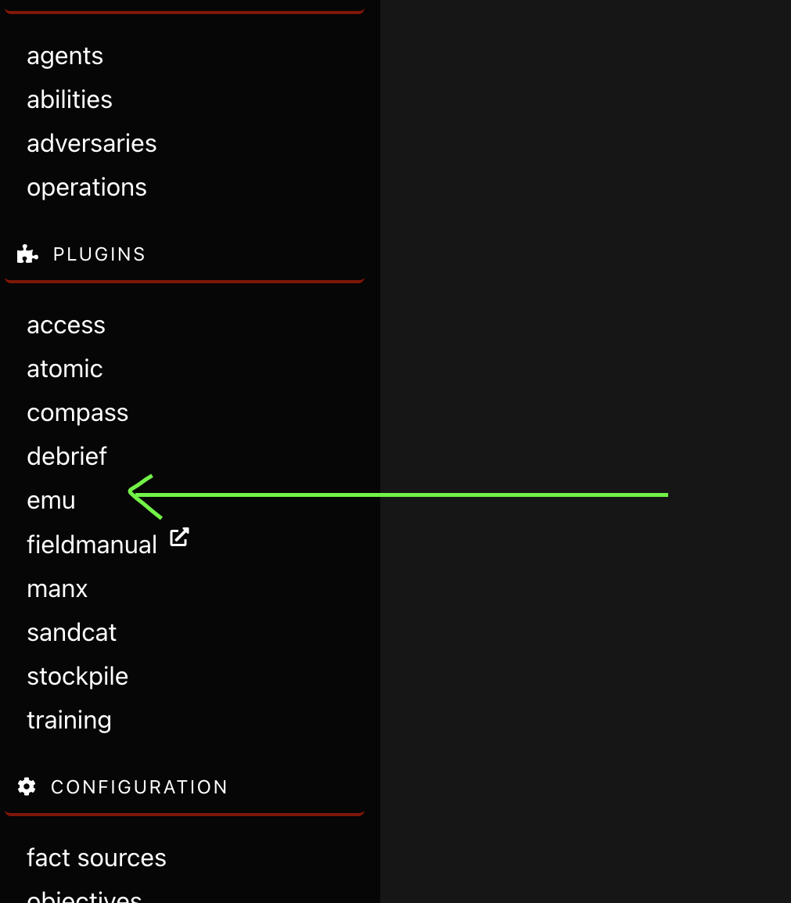
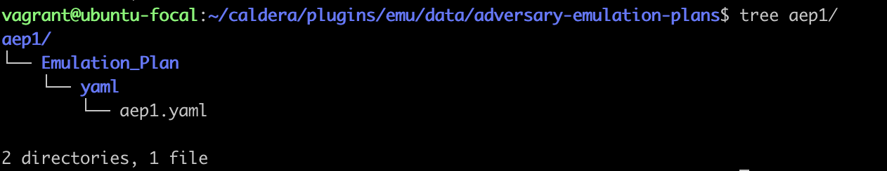
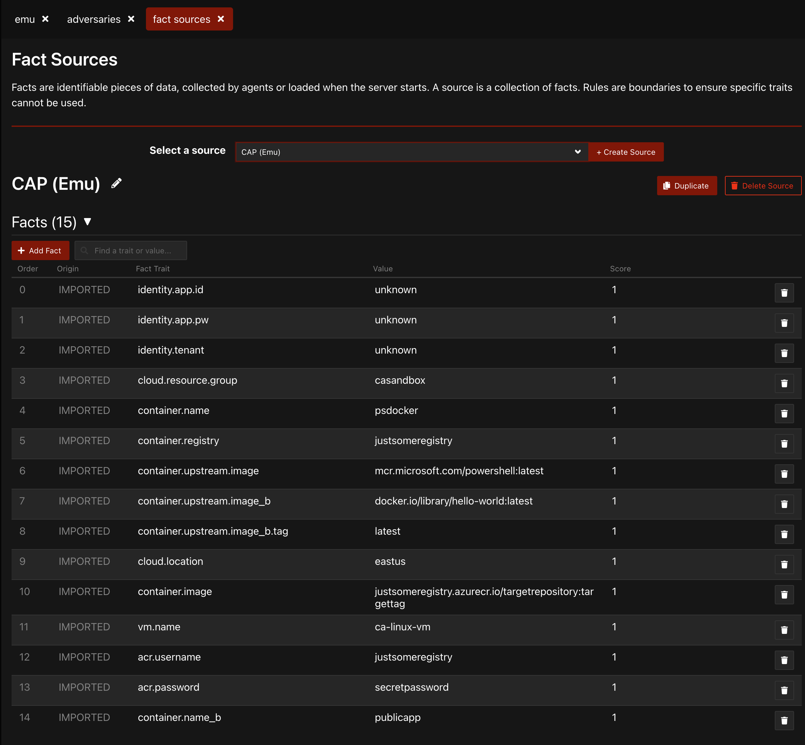

# Using Cloud Analytics with Caldera

Using the emu plugin for Caldera makes it easy, but it is not obvious at all how it works. The high level process is as follows:

__NOTE__: Caldera 4.0.0-beta was used for the following instructions. Not tested on other versions.

## Setup

### Ensure EMU Plugin is Enabled

Make sure the emu plugin is enabled within Caldera. If not, navigate to _Configuration_ -> _configuration_-> _Plugins_, and enable the emu plugin, and restart Caldera. When enabled, you should see `emu` on the left side menu.

## Install New Advesary Emulation Plan

### Option A: Install From AEP Archive

1. On the command line on the Caldera system, navigate to the following directory (`CALDERA_HOME` denotes the home directory of the Caldera installation).
   1. `cd CALDERA_HOME/plugins/emu/data/adversary-emulation-plans`
2. Copy the attached file to the Caldera system, and decompress while in the directory in the previous step.
   1. `tar -zxvf /path/to/aep1-package-caldera.tar.gz`
3. The resulting directory layout should look similar to the following:
   1. 

#### Option B: Create Directory Layout Manually

Alternatively, you can manually recreate the same structure.

1. `cd CALDERA_HOME/plugins/emu/data/adversary-emulation-plans`
2. `mkdir -p aep1/Emulation_Plan/yaml/`
3. `cp /path/to/aep1.yaml ./aep1/Emulation_Plan/yaml/`

#### Activate New Adversary Emulation Plan

After completing one of the above versions, restart Caldera.

## Validate

__NOTE__: The Cloud Analytics adversary name is currently CAP, short for Cloud Analytics Project.

### Adversary Profile

Within Caldera, _Adversary Profiles_ allow for collecting ATT&CK TTPs for a specific effect or scenario, such as an offensive or defensive scenario.

To validate the CAP profile is setup, within the Caldera web interface, navigate to _Plugins_ -> _emu_ -> _Adversaries_ -> _Select a profile_ -> ___CAP___.

A screen similar to the following should be displayed.

### Fact Sources

Within Caldera, _Fact Sources_ allow for using variables within an execution plan. Multiple fact source configurations can be setup for a profile, such as a fact source for the test environment. Along with Adversary Profiles, Fact Sources allow for executing predefined scenarios customized to a particular environment.

To validate the CAP Adversary Fact Source has been setup, within the Caldera web interface, navigate to _Configuration_ -> _fact sources_ -> _Select a source_ -> ___CAP___.

A screen similar to the following should be displayed.

